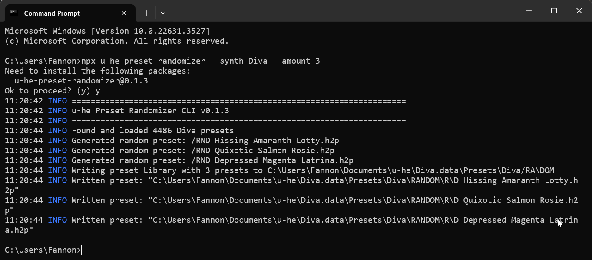

# u-he-preset-randomizer

Create random [u-he](https://u-he.com/) synth presets through randomization and merging of your existing presets.
In theory it should work with all u-he synths, but so far I haven't tested this (also, I don't own all of them).

This is only a MVP, with limited functionality:
* Generate fully random presets based on real values in your preset library
* Explicitly pick which existing presets to use for randomization and define amount of randomness applied to them
* Merge multiple chosen presets together, with randomness introduced by different ratios between them.

Future features could be:
* Refine method of randomization:
  * "Clustered randomization", which keeps consistency within a module
  * "Stable mode", which doesn't introduce randomization into some parameters, which tend to produce unstable results, e.g. pitch. Which params those are, depends on synth.
* Add a fully interactive CLI mode. When no arguments are given, the user will be asked for all values, with some guidance.
* Theoretically, a UI can be built on top, e.g. as an Electron application. But that would take significant amount of time, which I likely won't have.

## How to use

This is a CLI application that you need to run in your terminal / command line.

First you need to install the [Node.js](https://nodejs.org/en) runtime.
Then you can open your Terminal / Console / Command Prompt and start it by entering a command with some arguments.
They start with `npx u-he-preset-randomizer`, which will download and run the latest version of this tool.
Then some arguments follow where you pick what you want to do with the tool.

The generated patches will be put into your selected synth preset directory, under a `/RANDOM` folder.

### Generate Fully Randomized Presets

This command will run the randomizer to generate 3 fully randomized Diva presets.
Random values will be based on real values (and their distribution) of your actual presets. 

```sh
npx u-he-preset-randomizer --synth Diva --amount 3
```

### Randomize a particular Preset

This command will take one particular preset "HS Greek Horn" and create 5 random variations of it, with a 20% randomization ratio.

```sh
npx u-he-preset-randomizer --synth Diva --amount 5 --preset "HS Greek Horn" --randomness 20
```

### Merge multiple Presets together

This command will merge multiple presets together, with a random ratio on how much weight each one has in the "inheritance". 
The following example will take three Diva presets (each indicated with `--merge`) and create 5 merged variants out of them.

```bash
npx u-he-preset-randomizer --synth Diva --amount 5 --merge "HS Greek Horn" --merge "HS Strumpet" --merge "HS Baroqualog"
```

### Example Screenshot



### CLI Arguments

* `--synth`: Choose the u-he synth. Not all synths have been tested, but the randomizer tries to be generic. The name must match the folder name convention of u-he. E.g. `Diva`, `Hive`, `ZebraHZ`.
* `--amount`: How many presets to generate. Positive integer number.
* `--preset`: If given, an existing preset will be used as a based and randomized by `--randomness` ratio.
* `--randomness`: Amount of randomness (in percentage) to apply, when randomizing existing presets. Value needs to be between 0 and 100.
* `--merge`: Can be provided multiple times, for each preset that should be part of the merging. Ratio between merged presets is random and NOT driven by the `--randomness` parameter.
* `--debug`: Enables some optional debug logging and file exporting

## Developer Guide

To run this locally, check out the repo and:

```sh
npm i
npm run build
npm run start -- --synth Diva --amount 3

# or use ts-node:
ts-node src/cli.ts --synth Diva --amount 3
```

I've also exposed the u-he preset parser / serializer functions in the NPM module, so they could be used programmatically by other projects. However, you might inherit more dependencies than necessary if you're just interested in the parser. See [./src/parser.ts](./src/parser.ts).

## Help / Feedback

Please create a [GitHub issue](https://github.com/Fannon/u-he-preset-randomizer/issues).
