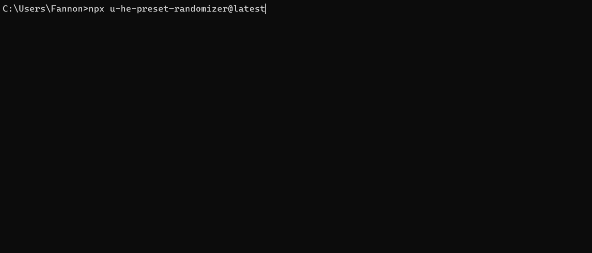

# u-he-preset-randomizer

Generate [u-he](https://u-he.com/) synth presets through randomization and merging of your existing presets.

This tool can generate random presets in three different modes:
* Generate **fully random presets** based on real values and value distributions in your preset library
* **Randomize existing presets**, with a customizable amount of randomness
* **Merge multiple presets** together, with randomness introduced by different ratios between them.

The randomization / merging approach is very generic and should work for all u-he synths.
Some may work better due to their simpler architecture (u-he Diva, Hive). 
More modular synths like Bazille, Zebra also work, but you may get more "varied" results.
 
> I could only test it on Windows so far. It might work on MacOS, but someone might need to confirm it.

See [Future Features and Ideas](#future-features--ideas) on what else could be added.

## How to use

This is a CLI application that you need to run in your terminal / command line.

First you need to install the [Node.js](https://nodejs.org/en) runtime.
Then you can open your Terminal / Console / Command Prompt and start it by entering a command with some arguments.
They start with `npx u-he-preset-randomizer`, which will download and run the latest version of this tool:

```sh
npx u-he-preset-randomizer@latest
```

This will start the tool in interactive mode. It will guide you though the necessary choices.
Alternatively, you can pass some arguments if you already know the choices (non interactive).

The generated patches will be put into your selected synth preset directory, under a `/RANDOM` folder.



### Generate Fully Randomized Presets

This command will run the randomizer to generate 3 fully randomized Diva presets.
Random values will be based on real values (and their distribution) of your actual presets. 

```sh
npx u-he-preset-randomizer@latest --synth Diva --amount 3
```

### Randomize a particular Preset

This command will take one particular preset "HS Greek Horn" and create 5 random variations of it, with a 20% randomization ratio.

```sh
npx u-he-preset-randomizer@latest --synth Diva --amount 5 --preset "HS Greek Horn" --randomness 20
```

### Merge multiple Presets together

This command will merge multiple presets together, with a random ratio on how much weight each one has in the "inheritance". 
The following example will take three Diva presets (each indicated with `--merge`) and create 5 merged variants out of them.

```bash
npx u-he-preset-randomizer@latest --synth Diva --amount 5 --merge "HS Greek Horn" --merge "HS Strumpet" --merge "HS Baroqualog"
```

### CLI Arguments / Configuration

* `--synth`: Choose the u-he synth. Not all synths have been tested, but the randomizer tries to be generic. The name must match the folder name convention of u-he. E.g. `Diva`, `Hive`, `ZebraHZ`.
* `--amount`: How many presets to generate. Positive integer number.
* `--randomness`: Amount of randomness (in percentage) to apply, when randomizing existing presets or resulting merged presets. Value needs to be between 0 and 100.
* `--preset`: If given, an existing preset will be used as a based and randomized by `--randomness` ratio.
  * Use "?" to choose random preset
  * Use `?search string?` to choose a random preset containing "search string" in its path and file name.
* `--merge`: Can be provided multiple times, for each preset that should be part of the merging. Ratio between merged presets is random and NOT driven by the `--randomness` parameter.
  * Use `?` to choose random preset
  * Use `?search string?` to choose a random preset containing "search string" in its path and file name.
  * Use `*` to select all presets (careful! Better first reduce via `--pattern`.)
  * Use `*search string*` to select all presets containing "search string" in its path and file name.
* `--pattern`: Define a [glob pattern](https://code.visualstudio.com/docs/editor/glob-patterns), which presets should be loaded. 
  * By default, it's `**/*` which will load all presets from all sub-folders.
  * To select a subfolder, use e.g. `My Folder/**/*`
  * To select presets starting with something, use e.g. `**/PD *`
- `--stable`: Uses more stable randomization approach
  * For fully random presets, it will randomize not per parameter, but per section (e.g. the entire OSC1 together)
  * Only parameters with numeric non-binary assignments will be further randomized. Otherwise they stay consistent with the chosen base preset or a random starter preset.
- `--binary`: Keep the binary part of the u-he presets. They will not be changed, but randomly generated presets will now include the binary section of either a random preset or the base preset that is randomized.
  * ⚠ Since the randomizer doesn't really parse and understand the binary section, this may lead to broken presets that may crash your synth plugin when loading. Use with care. For some synths this works better (Diva, Zebralette 3) and for some it frequently leads to invalid presets.
* `--debug`: Enables some optional debug logging and file exporting

## Developer Guide

To run this tool locally in developer mode, check out the repo and:

```sh
npm i
npm run build
npm run start -- --synth Diva --amount 3

# or use tsx (install via npm i -g tsx):
tsx src/cli.ts --synth Diva --amount 3
```

I've also exposed the u-he preset parser / serializer functions in the NPM module, so they could be used programmatically by other projects. However, you might inherit more dependencies than necessary if you're just interested in the parser. See [./src/parser.ts](./src/parser.ts).

## Future Features / Ideas

Future features could be:

* Refine method of randomization:
  * Figure out which parameters / section are not active in the patch and ignore them?
* Theoretically, a UI can be built on top, e.g. as an Electron application. But that would take significant amount of time, which I likely won't have.

## Help / Feedback

Please use the [related KVR Thread](https://www.kvraudio.com/forum/viewtopic.php?p=8898478) or create a [GitHub issue](https://github.com/Fannon/u-he-preset-randomizer/issues).
